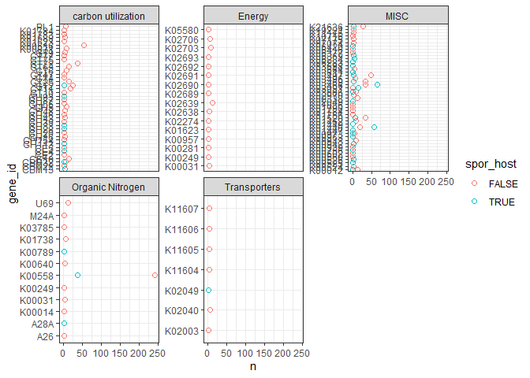

Assign host sporulation
================
Daniel Schwartz

# The Goal

After matching hosts to the viral-Refseq viruses and assigning thier
sporulation status we now test if DRAM detedted AMGs are enriched in
hosts of sporrulators.

# import data

-   data on hosts of refseq viruses from “B_assign-sporulator-refseq”

-   Curated list of sporulation in families of Firmicutes.

-   Sporulation genes

``` r
#  data on hosts of refseq viruses
d.vir <- read_csv(here("enrichment/data/Viruses/refseq_phages_wHost_spor.csv"))
```

    ## Rows: 3690 Columns: 36
    ## -- Column specification --------------------------------------------------------
    ## Delimiter: ","
    ## chr (14): refseq.id.x, virus.name, virus.lineage, refseq.id.y, host.name, ho...
    ## dbl (14): VIRSorter category, Prophage, Gene count, Strand switches, potenti...
    ## lgl  (8): Circular, Transposase present, KEGG.GENOME, KEGG.DISEASE, DISEASE,...
    ## 
    ## i Use `spec()` to retrieve the full column specification for this data.
    ## i Specify the column types or set `show_col_types = FALSE` to quiet this message.

``` r
#  data on amgs detected in refseq viruses
d.amg <- 
  read_tsv(here("enrichment/data/Viruses/amg_summary.tsv")) %>% 
  # adjust scaffold for joining
  mutate(refseq.id = str_remove(scaffold,"\\.."))
```

    ## Rows: 3823 Columns: 10
    ## -- Column specification --------------------------------------------------------
    ## Delimiter: "\t"
    ## chr (9): gene, scaffold, gene_id, gene_description, category, header, subhea...
    ## dbl (1): auxiliary_score
    ## 
    ## i Use `spec()` to retrieve the full column specification for this data.
    ## i Specify the column types or set `show_col_types = FALSE` to quiet this message.

``` r
spor_genes <-  read_csv(here("spor_gene_list/data/dram_spore_genes.csv"))
```

    ## Rows: 1230 Columns: 9
    ## -- Column specification --------------------------------------------------------
    ## Delimiter: ","
    ## chr (8): gene_id.ko, gene_id.uniref90, gene_description, module, sheet, head...
    ## lgl (1): potential_amg
    ## 
    ## i Use `spec()` to retrieve the full column specification for this data.
    ## i Specify the column types or set `show_col_types = FALSE` to quiet this message.

Next we add the data on host sporulation to the AMGs.

``` r
# add host sporulation to amg
d.amg <-
  d.vir %>% 
  select(refseq.id = refseq.id.x, phylum, spor_host) %>% 
  left_join(d.amg,., by = "refseq.id")

d.amg %>% group_by(spor_host) %>% summarise(n=n())
```

    ## # A tibble: 3 x 2
    ##   spor_host     n
    ##   <lgl>     <int>
    ## 1 FALSE      3349
    ## 2 TRUE        444
    ## 3 NA           30

We have host sporulation assigned to all but 30 gene rows. That is
reasonable.

# Enrichment test

``` r
#significance threshold
p.signif <- 1e-3

k_treshold <- 8
```

First we summarize the number of phages infecting hosts that sporulate
or not

``` r
d.host <- 
  d.vir %>% 
  group_by(spor_host) %>% 
  summarise(n=n())

total_sporulators <- 
  d.host %>% 
  filter(spor_host) %>% 
  pull(n) 

total_nonSporulators <- 
  d.host %>% 
  filter(!spor_host) %>% 
  pull(n) 

d.host
```

    ## # A tibble: 3 x 2
    ##   spor_host     n
    ##   <lgl>     <int>
    ## 1 FALSE      3393
    ## 2 TRUE        257
    ## 3 NA           40

For each gene we ask how many times it is found in a phage infecting a
sporulator or a non-sporulator host.

``` r
# Summarise total number of sporulators and non sporulators
d.amg.sum <- d.amg %>%
  # filter(str_detect(header, regex("sporulation", ignore_case = T))) %>%
  filter(!is.na(gene_id)) %>% 
  filter(!is.na(spor_host)) %>% 
  group_by(gene_id, gene_description, category,spor_host) %>%
  summarise(n = n()) %>%
  arrange(desc(n))
```

    ## `summarise()` has grouped output by 'gene_id', 'gene_description', 'category'.
    ## You can override using the `.groups` argument.

``` r
d.amg.sum %>%
  ggplot(aes(gene_id, n, color = spor_host))+
  geom_point(shape=21, size=2)+
  facet_wrap(~category, scales = "free_y")+
  coord_flip()+
  theme_bw()
```

<!-- -->

``` r
d_enrich <- 
  d.amg %>% 
  
  # Summarize KOs by host sporulation
  mutate(spor_host = case_when(
    is.na(spor_host) ~ "unkownSpor_host",
    spor_host ~ "spor_host",
    ! spor_host ~ "nonSpor_host"
  )) %>% 
  filter(!is.na(gene_id)) %>% 
  group_by(gene_id, spor_host) %>% 
  summarise(n=n(), .groups = "drop") %>% 
  pivot_wider(values_from = n, names_from = spor_host, values_fill = 0) %>% 
    
    # q : the number of white balls drawn without replacement 
    # from an urn which contains both black and white balls.
    # >>> AMG (specific gene) in viruses infecting sporulators
    mutate(q = spor_host) %>% 
    
    # m :the number of white balls in the urn.
    # >>> number of viruses infecting sporulators in the pool
    mutate(m = total_sporulators) %>% 
    
    # n :the number of black balls in the urn.
    # >>> number of viruses infecting non-sporulators in the pool
    mutate(n = total_nonSporulators) %>% 
    
    # k: the number of balls drawn from the urn, hence must be in 0,1,., m+n.
    # >>> Total AMG (specific gene) detected in viruses
    mutate(k = spor_host + nonSpor_host) %>% 
    
    mutate(p.val = signif (phyper(q, m, n, k, lower.tail =F),5)) %>% 
  # Adjust Pvalue for multiple testing
    mutate(p.adj = signif (p.adjust(p.val, method = "BH"),5)) %>% 
  # mark significantly enriched genes
   mutate(significant = (p.adj < p.signif) & (k>k_treshold))
```

# Plot enrichment results

``` r
# labels for significant genes
labels <- 
  d.amg %>% 
  select(gene_id,gene_description) %>% 
  distinct() %>% 
  filter(gene_id %in% d_enrich$gene_id[d_enrich$significant]) %>% 
  mutate(lab = str_remove(gene_description, "[;|\\[].*")) %>% 
  group_by(gene_id) %>% 
  summarise(p_lab = str_c(lab, collapse = "\n")) %>% 
  #adjustment of one label
  mutate(p_lab = if_else(gene_id == "K00558", paste0(p_lab, "\n"), p_lab))

d_enrich <-
  left_join(d_enrich, labels,  by = "gene_id") 


  #mark sporulation genes
d_enrich <- d_enrich %>% 
  mutate(spor_gene = if_else(gene_id %in% unique(spor_genes$gene_id.ko),
         "Spoulation genes", "Other genes"))

# plot
p <-
  d_enrich %>% 
  filter(k>0) %>%
  ggplot(aes(k,-log10(p.adj+1e-120)))+
  geom_hline(yintercept = -log10(p.signif), linetype=2, color="grey", size = 1)+
  geom_vline(xintercept = k_treshold, linetype=2, color="grey", size = 1)+
  
  geom_text_repel(aes(label = p_lab), size = 3, na.rm = T, point.padding = 2, min.segment.length = 0,seed = 123)+
  
  geom_jitter(aes(fill = significant),width = 0.05, height = 0.05,
              shape=21, size=3, stroke = 1, show.legend = F)+
  scale_fill_viridis_d(direction = -1, alpha = 0.5)+
  theme_classic()+
  facet_wrap(~ spor_gene %>% fct_rev(), ncol = 2) +
  panel_border(color = "black")+
  scale_x_continuous(trans = "log2", breaks = (2^(0:11)))+
  xlab("Sample size\nNo. homologs detected (log2)")+
  ylab("Enrichment (-log10 adj. P-value)")+
  theme(axis.text.x = element_text(angle = 90, vjust = 0.5, hjust = 1),
        strip.background = element_blank(),
        strip.text = element_text(face = "bold"))

ggsave(here("enrichment/plots/enrichmnent.png"),
       height =3 ,width = 6)
p
```

<!-- -->

Export stats

``` r
d_enrich %>% 
  arrange(desc(spor_gene), desc(significant), p.adj) %>% 
  write_csv(here("enrichment/data","enrichment_stats.csv"))
```
